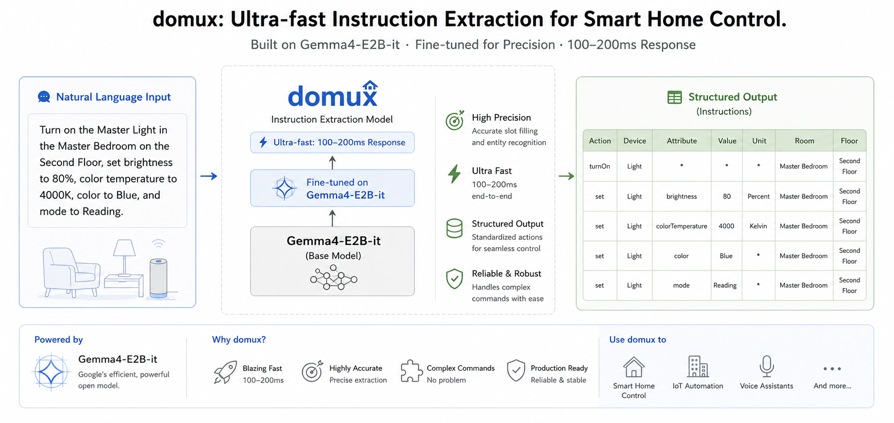
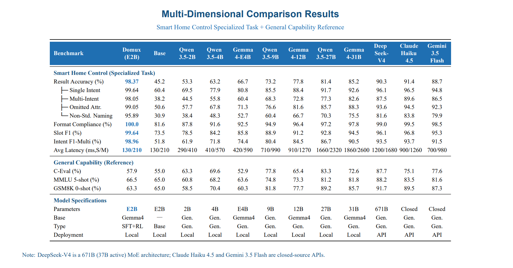

<div align="center">
  
</div>

<div align="center">
  <b>English</b> | <a href="README_zh.md">简体中文</a>
</div>

---
<div align="center">
  <h1>Domux</h1>
  <p><b>A lightweight, low-latency command understanding model for smart-home control.</b></p>

  <p>
    <a href="https://huggingface.co/iFlytekOpenSource/Domux"></a>
    <a href="https://modelscope.cn/models/iflytek/domux"></a>
    <a href="LICENSE"></a>
    <a href="#-quick-start"></a>
  </p>
</div>

---

<div align="center">
  
</div>

> 🚀 **An experiment, and an open invitation.** Domux explores a new idea: how far can text semantic parsing go under an aggressive latency budget — keeping end-to-end response under **150ms**? This is an early-stage exploration, and we're sharing it in the hope that others will try it too. If this direction interests you, we'd love for you to follow along and explore it together.

Domux (`Domux-Gemma-4-E2B-it`) is a fine-tuned language model built on **Gemma-4-E2B-it**. It turns natural-language smart-home commands into structured, pipe-delimited slots. Training combines supervised fine-tuning (SFT) with reinforcement learning via Group Relative Policy Optimization (GRPO) and custom reward functions.

## 📰 News

- **2026.06.30** — 🎉 Released **v0.1.0**, the first open-source release. See [CHANGELOG](CHANGELOG.md).
- **2026.06.29** — Released training code, reward plugins, and example datasets.
- **2026.06.25** — Initial release of Domux based on Gemma-4-E2B-it.

> Full version history: [CHANGELOG.md](CHANGELOG.md)

## ✨ Key Features

- **Fast response** — Optimized for low-latency inference on edge devices and servers.
- **Structured slot output** — Parses free-form commands into a fixed 7-field pipe-delimited schema.
- **High accuracy** — 98.37% result accuracy with 100% format compliance, outperforming much larger models.
- **Lightweight base** — Built on the compact Gemma-4-E2B-it, suitable for on-device and edge deployment.
- **Multi-action support** — Handles compound commands that map to multiple slot lines.
- **Generalizes across devices** — Handles arbitrary device names within each category, not a fixed whitelist.

## 🏠 Supported Control Capabilities

Domux is built on a generalist base model that **does not rely on a fixed device whitelist** — the model handles diverse device names through semantic understanding. The tables below show core capabilities; full specification at [Output Format Documentation](docs/output-spec.md).

### Device Types & Attributes

| Device Type | Naming Examples | Controllable Attributes | Value Range |
| --- | --- | --- | --- |
| **Light** | Light、Strip Light、Spot Light、Desk Lamp | `brightness`<br>`color`<br>`colorTemperature`<br>`mode` | 0–100%<br>Blue、Red、Green、Yellow、White, etc.<br>3000–6500 K<br>Reading、Romance、Soft, etc. |
| **AC** | AC、AC 1 | `temperature`<br>`mode`<br>`windSpeed` | 16–30 °C<br>Cool、Heat、Dry、Fan、Auto<br>Low、Medium、High |
| **Curtain** / **Blind** | Curtain、Blind、Sheer Curtain | `position` | 0–100% |
| **Scene Mode** | Romantic Mode、Party Mode、Sleeping Mode | — | — |

### Control Actions

| Action | Description | Example Commands |
| --- | --- | --- |
| `turnOn` | Turn on device | *"Turn on the living room light"* |
| `turnOff` | Turn off device | *"Turn off the AC"* |
| `set` | Set to specific value | *"Set brightness to 80%"*、*"Set AC to 24 degrees"* |
| `adjustUp` | Increase attribute | *"Make it brighter"*、*"Increase the temperature a bit"* |
| `adjustDown` | Decrease attribute | *"Dim the light"*、*"Turn down the AC"* |
| `activate` | Activate scene mode | *"Activate romantic mode"* |
| `deactivate` | Deactivate scene mode | *"Deactivate party mode"* |
| `pause` | Pause curtain movement | *"Stop the curtain"* |

### Spatial Context

**Room Support**: Living Room、Bedroom、Kitchen、Bathroom、Home Office、Balcony、Master Bedroom, etc. Supports numbering (Bedroom 1、Room A) and culturally specific rooms (Majlis、Prayer Room).

**Floor Support**: Ground Floor、First Floor、Second Floor、Upstairs、Downstairs, etc.

### Fuzzy Command Handling

Adjustment commands without explicit values (e.g., *"make it brighter"*, *"turn it down a bit"*) map to `adjustUp` / `adjustDown` with the value field left empty (`*`), allowing downstream systems to determine the adjustment magnitude based on current state.

### Roadmap

As an early exploration, Domux is still evolving. We're focusing on three directions:

- 🔜 **Broader device coverage** — more categories beyond lighting, climate, window, and audio
- 🔜 **Richer scenes** — support for more scenes and modes
- 🔜 **Stronger fuzzy-intent understanding** — better handling of vague, implicit, and context-dependent commands

## 🎬 Demo

The model outputs pipe-delimited slots with 7 fields:

```
action|device|attribute|value|unit|room|floor
```

### Basic Examples

| Input | Output |
| --- | --- |
| Turn on the living room light | `turnOn\|Light\|*\|*\|*\|Living Room\|*` |
| Set bedroom AC to 22 degrees | `set\|AC\|temperature\|22\|Celsius\|Bedroom\|*` |
| Close the curtains 20 percent | `adjustDown\|Curtain\|openness\|20\|Percent\|*\|*` |

### Complex Multi-Attribute Command

**Input:**
```
Turn on the Master Light in the Master Bedroom on the Second Floor, 
set brightness to 80%, color temperature to 4000K, color to Blue, and mode to Reading.
```

**Output:**
```
turnOn|Light|*|*|*|Master Bedroom|Second Floor
set|Light|brightness|80|Percent|Master Bedroom|Second Floor
set|Light|colorTemperature|4000|Kelvin|Master Bedroom|Second Floor
set|Light|color|Blue|*|Master Bedroom|Second Floor
set|Light|mode|Reading|*|Master Bedroom|Second Floor
```

### Multi-Room Scenario

**Input:**
```
Turn off all lights in the Living Room on the Ground Floor, 
set the AC to Cool mode at 24 degrees in the Guest Bedroom, 
and open the curtains halfway in the Dining Room.
```

**Output:**
```
turnOff|Light|*|*|*|Living Room|Ground Floor
set|AC|mode|Cool|*|Guest Bedroom|*
set|AC|temperature|24|Celsius|Guest Bedroom|*
set|Curtain|openness|50|Percent|Dining Room|*
```

Use `*` for unspecified or don't-care fields.

## 📊 Benchmark

Evaluated on a comprehensive test set of **4,057 samples** across 4 dimensions (single intent, multi-intent, omitted attributes, non-standard naming), benchmarked against **11 mainstream models** including Qwen3.5 series (2B-27B), Gemma 4 series, and leading closed-source APIs (DeepSeek-V4, Claude Haiku 4.5, Gemini 3.5 Flash).

---

<div align="center">
  
</div>

📄 **Full technical report**: [English Report](docs/benchmark-report.pdf) ・ [中文报告](docs/benchmark-report.zh.pdf)

## 🧪 Open Dataset & Evaluation

We've open-sourced the **test set** and **evaluation script** behind the benchmark above, so you can reproduce our results or evaluate your own model.

- **Test set** — [`eval/smart_home_control_test_set.jsonl`](eval/smart_home_control_test_set.jsonl): 4,057 samples across four dimensions (single-intent, multi-intent, omitted attributes, non-standard naming), spanning three device categories (Light / AC / Curtain) with 67 device-name variants.
- **Evaluation script** — [`eval/run_eval.py`](eval/run_eval.py): sends each query to any OpenAI-compatible endpoint and reports format compliance, result accuracy, Slot F1, Intent F1, and average latency.
- **Docs** — see [`eval/DATASET_README.md`](eval/DATASET_README.md) for data format, metric definitions, and how to run.

```bash
pip install requests
# Fill in API_KEY / BASE_URL / MODEL in run_eval.py, then run
python eval/run_eval.py
```

## 📥 Model Download

| Model | Base | Hugging Face | ModelScope |
| --- | --- | --- | --- |
| Domux-Gemma-4-E2B-it | Gemma-4-E2B-it | [🤗 iFlytekOpenSource/Domux](https://huggingface.co/iFlytekOpenSource/Domux) | [🔧 iflytek/domux](https://modelscope.cn/models/iflytek/domux) |

**Download via**:

```bash
# Option 1: Hugging Face
git lfs install
git clone https://huggingface.co/iFlytekOpenSource/Domux

# Option 2: ModelScope
pip install modelscope
python -c "from modelscope import snapshot_download; snapshot_download('iflytek/domux', cache_dir='./models')"
```

## 🚀 Quick Start

### Hardware

The model runs in **BF16 precision** and requires **20GB+ of VRAM** for single-GPU deployment.

### Installation

```bash
# Option 1: vLLM
pip install "vllm==0.22.0"

# Option 2: SGLang
pip install "sglang[all]==0.5.12"
```

### Inference

Offline inference with vLLM. Pass the user command directly as the query:

```python
from vllm import LLM, SamplingParams

# Point to your downloaded model directory
llm = LLM(model="Domux", dtype="bfloat16")  # or "models/iflytek/domux"
sampling = SamplingParams(temperature=0.0, max_tokens=256)

prompt = "Turn on the Master Light in the Master Bedroom on the Second Floor, set brightness to 80%, color temperature to 4000K, color to Blue, and mode to Reading."
output = llm.chat([{"role": "user", "content": prompt}], sampling)
print(output[0].outputs[0].text)

# Output:
# turnOn|Light|*|*|*|Master Bedroom|Second Floor
# set|Light|brightness|80|Percent|Master Bedroom|Second Floor
# set|Light|colorTemperature|4000|Kelvin|Master Bedroom|Second Floor
# set|Light|color|Blue|*|Master Bedroom|Second Floor
# set|Light|mode|Reading|*|Master Bedroom|Second Floor
```

## 🔧 Deployment

Serve the model as an OpenAI-compatible API with either vLLM or SGLang.

### Serve with vLLM

```bash
python -m vllm.entrypoints.openai.api_server \
  --model Domux \
  --served-model-name domux \
  --host 0.0.0.0 \
  --port 8000 \
  --dtype bfloat16 \
  --max-model-len 2048 \
  --gpu-memory-utilization 0.9
```

### Serve with SGLang

```bash
python -m sglang.launch_server \
  --model-path Domux \
  --host 0.0.0.0 \
  --port 8000 \
  --dtype bfloat16 \
  --context-length 2048
```

### Call the API

Both servers expose the same OpenAI-compatible endpoint:

```python
from openai import OpenAI

client = OpenAI(
    base_url="http://localhost:8000/v1",
    api_key="EMPTY"
)

response = client.chat.completions.create(
    model="domux",
    messages=[
        {"role": "user", "content": "Turn on the Master Light in the Master Bedroom on the Second Floor, set brightness to 80%, color temperature to 4000K, color to Blue, and mode to Reading."}
    ],
    temperature=0.0
)

res = response.choices[0].message.content
print(res)

# Output:
'''
turnOn|Light|*|*|*|Master Bedroom|Second Floor
set|Light|brightness|80|Percent|Master Bedroom|Second Floor
set|Light|colorTemperature|4000|Kelvin|Master Bedroom|Second Floor
set|Light|color|Blue|*|Master Bedroom|Second Floor
set|Light|mode|Reading|*|Master Bedroom|Second Floor
'''
```

## 📄 License

See the [LICENSE](LICENSE) file in this repository.

## 🙏 Acknowledgments

- Base model: [Gemma](https://deepmind.google/models/gemma/)
- Training framework: [ModelScope-Swift](https://github.com/modelscope/ms-swift)
- Experiment tracking: [SwanLab](https://swanlab.cn/)
