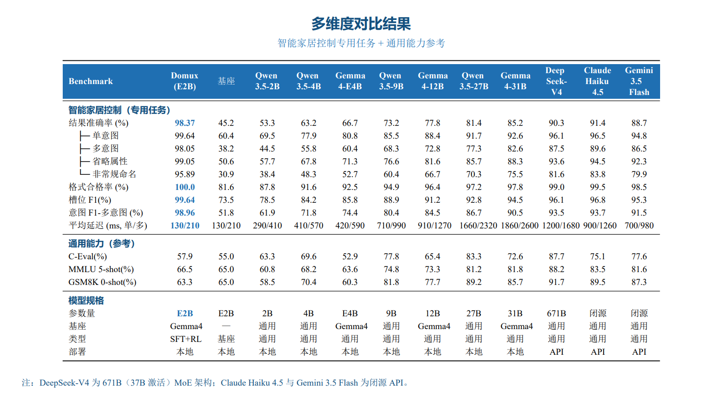

<div align="center">
  
</div>

<div align="center">
  <a href="README.md">English</a> | <b>简体中文</b>
</div>

---
<div align="center">
  <h1>Domux</h1>
  <p><b>开源、轻量、低延迟的智能家居指令解析模型</b></p>

  <p>
    <a href="https://huggingface.co/iFlytekOpenSource/Domux"></a>
    <a href="https://modelscope.cn/models/iflytek/domux"></a>
    <a href="LICENSE"></a>
    <a href="#-快速开始"></a>
  </p>
</div>

---

<div align="center">
  
</div>

> 🚀 **一次尝试，也是一份邀请。** Domux 探索了一个新思路：在追求极致响应速度的目标下（端到端响应耗时控制在 **150ms 以内**），文本的语义处理能做到什么程度？这还是非常早期的探索，我们把它分享出来，希望有更多人一起尝试。如果你也对这个方向感兴趣，欢迎关注，一起探索新思路。

Domux 是面向家庭自动化的开源**智能家居指令理解模型**，支持意图识别、语义解析和槽位填充，可将自然语言设备控制请求转换为可执行、可评测的确定性结构化数据。

Domux (`Domux-Gemma-4-E2B-it`) 基于 **Gemma-4-E2B-it** 微调，将智能家居指令转换为结构化的竖线分隔槽位。训练结合了监督微调（SFT）与基于组相对策略优化（GRPO）的强化学习和自定义奖励函数。

## 快速导航

| 资源 | 说明 |
| --- | --- |
| [Hugging Face](https://huggingface.co/iFlytekOpenSource/Domux) / [ModelScope](https://modelscope.cn/models/iflytek/domux) | 下载 Domux 模型权重 |
| [中文 benchmark 报告](docs/benchmark-report.zh.pdf) / [English benchmark report](docs/benchmark-report.pdf) | 查看完整评测方法与结果 |
| [评测数据集与脚本](eval/DATASET_README.md) | 复现 4,057 条样本评测，或测试其他 OpenAI 兼容模型 |
| [输出格式说明](docs/output-spec.zh.md) / [English spec](docs/output-spec.md) | 集成 7 字段智能家居控制格式 |

## 📰 更新动态

- **2026.06.30** — 开源 **v0.1.0** 代码；正式 GitHub 标签与 Release 的发布进度见 [#18](https://github.com/iflytek/domux/issues/18)。详见 [CHANGELOG](CHANGELOG.md)。
- **2026.06.29** — 发布训练代码、奖励插件和示例数据集。
- **2026.06.25** — 基于 Gemma-4-E2B-it 的 Domux 首次发布。

> 完整版本历史：[CHANGELOG.md](CHANGELOG.md)

## ✨ 核心特性

- **快速响应** — 针对边缘设备和服务器的低延迟推理进行优化。
- **结构化槽位输出** — 将自由格式指令解析为固定的 7 字段竖线分隔格式。
- **高准确率** — 98.37% 结果准确率，100% 格式合规性，超越体量大得多的模型。
- **轻量级基座** — 构建于紧凑的 Gemma-4-E2B-it 之上，适合设备端和边缘部署。
- **多动作支持** — 处理映射到多个槽位行的复合指令。
- **跨设备泛化** — 处理每个类别下的任意设备名，而非固定白名单。

## 适用场景

- 将语音助手或文本指令解析为确定性的家庭自动化操作。
- 为边缘端或服务端应用增加轻量级意图识别与槽位填充能力。
- 使用内置的 4,057 条样本 benchmark 评测指令理解模型。
- 构建需要 OpenAI 兼容 API 与稳定 7 字段输出格式的集成。

## 🏠 支持的控制能力

Domux 基于具备泛化能力的基座模型，**不依赖固定的设备白名单** —— 模型通过语义理解处理各类设备名称。下表展示核心控制能力，完整规范见 [输出格式文档](docs/output-spec.zh.md)。

### 设备类型与属性

| 设备类型 | 命名示例 | 可控属性 | 取值范围 |
| --- | --- | --- | --- |
| **灯具** `Light` | Light、Strip Light、Spot Light、Desk Lamp | `brightness` 亮度<br>`color` 颜色<br>`colorTemperature` 色温<br>`mode` 灯光模式 | 0–100%<br>Blue、Red、Green、Yellow、White 等<br>3000–6500 K<br>Reading、Romance、Soft 等 |
| **空调** `AC` | AC、AC 1 | `temperature` 温度<br>`mode` 空调模式<br>`windSpeed` 风速 | 16–30 °C<br>Cool、Heat、Dry、Fan、Auto<br>Low、Medium、High |
| **窗饰** `Curtain` / `Blind` | Curtain、Blind、Sheer Curtain | `position` 开合位置 | 0–100% |
| **场景模式** | Romantic Mode、Party Mode、Sleeping Mode | — | — |

### 控制动作

| 动作 | 说明 | 典型指令示例 |
| --- | --- | --- |
| `turnOn` | 打开设备 | *"Turn on the living room light"* |
| `turnOff` | 关闭设备 | *"Turn off the AC"* |
| `set` | 设置到具体值 | *"Set brightness to 80%"*、*"Set AC to 24 degrees"* |
| `adjustUp` | 增加属性值 | *"Make it brighter"*、*"Increase the temperature a bit"* |
| `adjustDown` | 减少属性值 | *"Dim the light"*、*"Turn down the AC"* |
| `activate` | 激活场景模式 | *"Activate romantic mode"* |
| `deactivate` | 取消场景模式 | *"Deactivate party mode"* |
| `pause` | 暂停窗帘运动 | *"Stop the curtain"* |

### 空间定位

**房间支持**：Living Room、Bedroom、Kitchen、Bathroom、Home Office、Balcony、Master Bedroom 等，支持编号（Bedroom 1、Room A）和文化特色房间（Majlis、Prayer Room）。

**楼层支持**：Ground Floor、First Floor、Second Floor、Upstairs、Downstairs 等。

### 模糊指令处理

不带明确数值的调整指令（如 *"make it brighter"*、*"turn it down a bit"*）会映射为 `adjustUp` / `adjustDown`，值字段留空（`*`），由下游系统根据当前状态决定调整幅度。

### 路线图

作为早期探索，Domux 仍在持续演进，后续计划聚焦三个方向：

- 🔜 **更广的设备覆盖** — 在灯具、温控、窗饰、音频之外扩展更多品类
- 🔜 **更丰富的场景** — 支持更多场景与模式
- 🔜 **更强的模糊意图理解** — 更好地处理含糊、隐含和依赖上下文的指令

## 🎬 示例演示

模型输出包含 7 个字段的竖线分隔槽位：

```
action|device|attribute|value|unit|room|floor
```

### 基础示例

| 输入 | 输出 |
| --- | --- |
| Turn on the living room light（打开客厅的灯） | `turnOn\|Light\|*\|*\|*\|Living Room\|*` |
| Set bedroom AC to 22 degrees（将卧室空调设为 22 度） | `set\|AC\|temperature\|22\|Celsius\|Bedroom\|*` |
| Close the curtains 20 percent（关闭窗帘 20%） | `adjustDown\|Curtain\|openness\|20\|Percent\|*\|*` |

### 复杂多属性指令

**输入：**
```
Turn on the Master Light in the Master Bedroom on the Second Floor, 
set brightness to 80%, color temperature to 4000K, color to Blue, and mode to Reading.
（打开二楼主卧的主灯，将亮度设为 80%，色温设为 4000K，颜色设为蓝色，模式设为阅读）
```

**输出：**
```
turnOn|Light|*|*|*|Master Bedroom|Second Floor
set|Light|brightness|80|Percent|Master Bedroom|Second Floor
set|Light|colorTemperature|4000|Kelvin|Master Bedroom|Second Floor
set|Light|color|Blue|*|Master Bedroom|Second Floor
set|Light|mode|Reading|*|Master Bedroom|Second Floor
```

### 多房间场景

**输入：**
```
Turn off all lights in the Living Room on the Ground Floor, 
set the AC to Cool mode at 24 degrees in the Guest Bedroom, 
and open the curtains halfway in the Dining Room.
（关闭一楼客厅的所有灯，将客房空调设为制冷模式 24 度，将餐厅窗帘打开一半）
```

**输出：**
```
turnOff|Light|*|*|*|Living Room|Ground Floor
set|AC|mode|Cool|*|Guest Bedroom|*
set|AC|temperature|24|Celsius|Guest Bedroom|*
set|Curtain|openness|50|Percent|Dining Room|*
```

使用 `*` 表示未指定或无关字段。

## 📊 Benchmark

在涵盖 4 个维度（单意图、多意图、属性省略、非标准命名）的 **4,057 个样本**的综合测试集上进行评估，与 **11 个主流模型**进行基准对比，包括 Qwen3.5 系列（2B-27B）、Gemma 4 系列以及领先的闭源 API（DeepSeek-V4、Claude Haiku 4.5、Gemini 3.5 Flash）。

---

<div align="center">
  
</div>

📄 **完整技术报告**：[中文报告](docs/benchmark-report.zh.pdf) ・ [English Report](docs/benchmark-report.pdf)

## 🧪 开源数据集与评测

我们开源了用于上述评测的**测试集**与**评测脚本**，方便你独立复现结果或评估自己的模型。

- **测试集** —— [`eval/smart_home_control_test_set.jsonl`](eval/smart_home_control_test_set.jsonl)：4,057 条样本，覆盖单意图、多意图、属性省略、非标准命名四个维度，含灯具 / 空调 / 窗帘三大类共 67 种设备名变体。
- **评测脚本** —— [`eval/run_eval.py`](eval/run_eval.py)：向任意 OpenAI 兼容接口发送指令，自动计算格式合规率、结果准确率、Slot F1、Intent F1 与平均延迟。
- **使用说明** —— 数据格式、指标定义和运行方式详见 [`eval/DATASET_README.md`](eval/DATASET_README.md)。

```bash
pip install requests
# 在 run_eval.py 中填入 API_KEY / BASE_URL / MODEL 后运行
python eval/run_eval.py
```

## 📥 模型下载

| 模型 | 基座 | Hugging Face | ModelScope |
| --- | --- | --- | --- |
| Domux-Gemma-4-E2B-it | Gemma-4-E2B-it | [🤗 iFlytekOpenSource/Domux](https://huggingface.co/iFlytekOpenSource/Domux) | [🔧 iflytek/domux](https://modelscope.cn/models/iflytek/domux) |

**下载方式**：

```bash
# 方式 1：从 Hugging Face 下载
git lfs install
git clone https://huggingface.co/iFlytekOpenSource/Domux

# 方式 2：从 ModelScope 下载
pip install modelscope
python -c "from modelscope import snapshot_download; snapshot_download('iflytek/domux', cache_dir='./models')"
```

## 🚀 快速开始

### 硬件

模型以 **BF16 精度**运行，单卡部署需要 **20GB 及以上显存**。

### 安装

```bash
# 方式 1：vLLM
pip install "vllm==0.22.0"

# 方式 2：SGLang
pip install "sglang[all]==0.5.12"
```

### 推理

使用 vLLM 进行离线推理。直接将用户指令作为 query 输入：

```python
from vllm import LLM, SamplingParams

# 指向你下载的模型目录
llm = LLM(model="Domux", dtype="bfloat16")  # 或 "models/iflytek/domux"
sampling = SamplingParams(temperature=0.0, max_tokens=256)

prompt = "Turn on the Master Light in the Master Bedroom on the Second Floor, set brightness to 80%, color temperature to 4000K, color to Blue, and mode to Reading."
output = llm.chat([{"role": "user", "content": prompt}], sampling)
print(output[0].outputs[0].text)

# 输出：
# turnOn|Light|*|*|*|Master Bedroom|Second Floor
# set|Light|brightness|80|Percent|Master Bedroom|Second Floor
# set|Light|colorTemperature|4000|Kelvin|Master Bedroom|Second Floor
# set|Light|color|Blue|*|Master Bedroom|Second Floor
# set|Light|mode|Reading|*|Master Bedroom|Second Floor
```

## 🔧 部署指南

使用 vLLM 或 SGLang 将模型部署为 OpenAI 兼容的 API 服务。

### 使用 vLLM 部署

```bash
python -m vllm.entrypoints.openai.api_server \
  --model Domux \
  --served-model-name domux \
  --host 0.0.0.0 \
  --port 8000 \
  --dtype bfloat16 \
  --max-model-len 2048 \
  --gpu-memory-utilization 0.9
```

### 使用 SGLang 部署

```bash
python -m sglang.launch_server \
  --model-path Domux \
  --host 0.0.0.0 \
  --port 8000 \
  --dtype bfloat16 \
  --context-length 2048
```

### 调用 API

两种服务均暴露相同的 OpenAI 兼容接口：

```python
from openai import OpenAI

client = OpenAI(
    base_url="http://localhost:8000/v1",
    api_key="EMPTY"
)

response = client.chat.completions.create(
    model="domux",
    messages=[
        {"role": "user", "content": "Turn on the Master Light in the Master Bedroom on the Second Floor, set brightness to 80%, color temperature to 4000K, color to Blue, and mode to Reading."}
    ],
    temperature=0.0
)

res = response.choices[0].message.content
print(res)

# 输出：
'''
turnOn|Light|*|*|*|Master Bedroom|Second Floor
set|Light|brightness|80|Percent|Master Bedroom|Second Floor
set|Light|colorTemperature|4000|Kelvin|Master Bedroom|Second Floor
set|Light|color|Blue|*|Master Bedroom|Second Floor
set|Light|mode|Reading|*|Master Bedroom|Second Floor
'''
```

## 📄 许可证

查看本仓库中的 [LICENSE](LICENSE) 文件。

## 🙏 致谢

- 基座模型：[Gemma](https://deepmind.google/models/gemma/)
- 训练框架：[ModelScope-Swift](https://github.com/modelscope/ms-swift)
- 实验跟踪：[SwanLab](https://swanlab.cn/)

## 💬 社区交流

欢迎加入 Astron 开源交流群（企业微信），与我们交流与合作：


