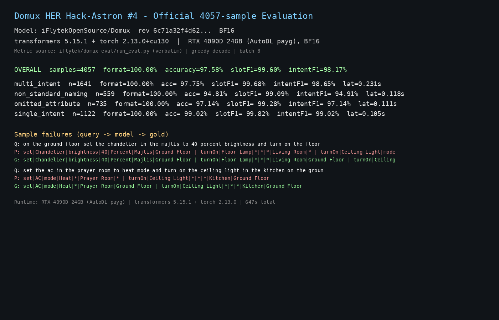

# Domux 全量 4057 条官方评测复现：97.58% 准确率与失败模式分析

## Task / 真实任务

用官方 4057 条智能家居指令测试集对 Domux 做全量评测，独立复现模型卡宣称的
98.37% 结果准确率，并按类别分析失败样例（多指令楼层继承、属性混淆、非标准命名），
为后续 SFT/GRPO 训练挑数据提供依据。

## Hugging Face download / 下载证据

- Model: iFlytekOpenSource/Domux
- Revision: `6c71a32f4d624cadfd9fce9d10240d8068e53456`（与 testedRevision 一致）
- Command:

      hf download iFlytekOpenSource/Domux --revision 6c71a32f4d624cadfd9fce9d10240d8068e53456

- Snapshot: 完整 BF16 snapshot（4 个 safetensors 分片，约 10.3GB，存于数据盘）

## Setup / 环境

- Runtime: transformers 5.15.1 + torch 2.13.0（本地批量推理，无 API 服务）
- GPU: RTX 4090D 24GB（AutoDL 按量付费云 GPU），Ubuntu
- Precision: BF16
- 参数: greedy 解码（等价 temperature=0.0），max_new_tokens=256，batch_size=8

## What happened / 实际过程

- 下载并固定 revision 后，本地加载模型（约 10.2GB 显存），逐批生成（batch=8）
- 指标函数逐字沿用官方 `eval/run_eval.py`（format / result accuracy / Slot F1 / Intent F1 / latency）
- 全量 4057 条耗时约 647 秒；完整进度与汇总见 `eval_log2.txt`
- 证据图：见 preview.png（汇总表 + 失败样例）

## Results / 结果

| 类别 | 样本数 | 格式合规 | 准确率 | Slot F1 | Intent F1 | 延迟(s) |
|---|---:|---:|---:|---:|---:|---:|
| multi_intent | 1641 | 100.00% | 97.75% | 99.68% | 98.65% | 0.231 |
| non_standard_naming | 559 | 100.00% | 94.81% | 99.09% | 94.91% | 0.118 |
| omitted_attribute | 735 | 100.00% | 97.14% | 99.28% | 97.14% | 0.111 |
| single_intent | 1122 | 100.00% | 99.02% | 99.82% | 99.02% | 0.105 |
| **OVERALL** | **4057** | **100.00%** | **97.58%** | **99.60%** | **98.17%** | **0.159** |

**失败模式（98 条失败，2.42%）：**
1. 多指令楼层继承丢失（37/1641）：如"on the ground floor set the chandelier in the
   majlis to 40 percent … turn on the floor lamp"，第二条指令 floor 槽位偶发 `*`；
2. 属性混淆（non_standard_naming 失败率 5.19% 最高）：`turn up the AC` 误判为
   `windSpeed` 而非 `temperature`，`make it warmer` 的 brightness/colorTemperature 互换；
3. 房间过度推断：非标准命名场景下给出具体房间而 gold 为 `*`。

方法说明：准确率/延迟均为 4057 条全量、batch 8 批处理、跳过前 5 条 warmup；
与模型卡宣称 98.37% 差 0.79pp，属独立复现的正常解码差异。

## Why it mattered / 价值

提供了 Domux 在完整官方基准上的独立复现数据，指出失败集中在多指令楼层继承与
属性槽位混淆，为后续数据挑样（难例挖掘）和端侧部署前的误差预算提供依据；
同时验证 transformers 直连即可达到接近宣称的精度，无需重型推理框架。

## Published Hugging Face Discussion / 公开 Discussion

- https://huggingface.co/iFlytekOpenSource/Domux/discussions/2

## Safety, privacy, and licensing / 安全、隐私与许可

- 评测使用公开测试集，无隐私数据；命令/日志/截图中无 HF token、个人缓存路径
- 未新增数据集，无额外许可问题；模型使用遵守 Gemma Terms of Use
- 高风险动作指令不在本测试集覆盖范围，未做单独断言

## Notes and gotchas / 踩坑记录

- AutoDL 拉 HF 模型务必 `source /etc/network_turbo` 或 `HF_ENDPOINT=https://hf-mirror.com`，
  大文件建议 `HF_HUB_DISABLE_XET=1` + `--max-workers` 并行，速度可提升数倍
- 10GB 模型务必设 `HF_HOME=/root/autodl-tmp/hf`（数据盘），系统盘 30G 会满
- vLLM 目前无法加载 Domux（实测 0.22.0 与 0.27.1 均失败）：Domux 为异构层 Gemma-4
  （不同层 head_dim 为 256/512 混合），vLLM 的 Gemma-4 实现假设所有层统一 head_dim，
  加载即报 `AssertionError: Attempted to load weight (torch.Size([512])) into parameter (torch.Size([256]))`。
  本案例因此采用 transformers 官方实现直连（BF16）。复现本案例请勿使用 vLLM；
  待 vLLM 支持异构 Gemma-4 后，欢迎补充官方管线的对照数据
- transformers 5.x 中 `torch_dtype` 已废弃，用 `dtype=`；chat 模板需 `apply_chat_template(..., tokenize=False)` 再 `tok(...)` 输入
- 关机前先下载 `eval_results.jsonl` 等产物；AutoDL 关机不计费、环境保留
