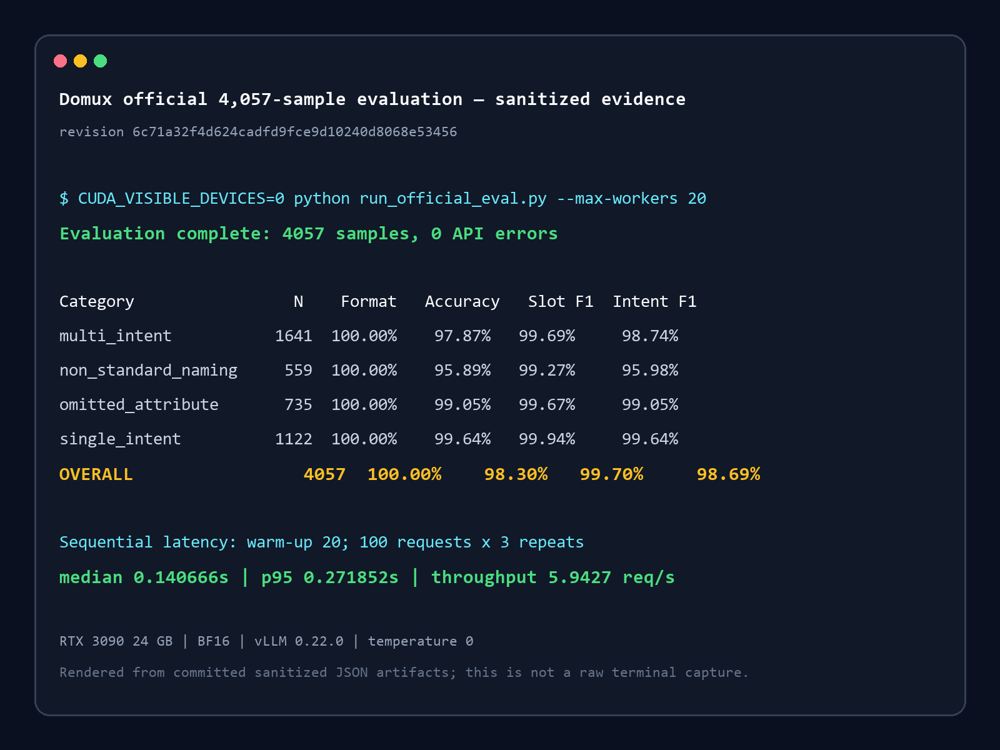

# Domux 4,057-sample open evaluation on RTX 3090

## Task / 真实任务

I reproduced the complete public Domux evaluation on a consumer RTX 3090, then
recomputed failure clusters by output field. The goal was to answer two practical
questions: whether the published result can be reproduced on accessible hardware,
and which command-understanding failures still matter in a real smart-home pipeline.

本案例在单张 RTX 3090 上运行官方 4,057 条测试集，并按 action、device、attribute、
value、unit、room、floor、多意图数量及格式错误重新聚类，避免只展示一个总体准确率。

## Hugging Face download / 下载证据

- Model: `iFlytekOpenSource/Domux`
- Tested revision: `6c71a32f4d624cadfd9fce9d10240d8068e53456`
- Download call: `huggingface_hub.snapshot_download(repo_id, revision=<testedRevision>)`
- Hugging Face endpoint used by this run: `https://hf-mirror.com`
- Snapshot size: 9.57 GiB
- Artifact: full Hugging Face BF16 snapshot; no model weights are included in this case.

## Setup / 环境

- Runtime: vLLM 0.22.0, Transformers 5.5.1, OpenAI-compatible `/v1/chat/completions`
- CUDA compiler used for FlashInfer JIT: 13.0.88; the driver and CUDA runtime are recorded below
- Hardware: one NVIDIA GeForce RTX 3090 24 GB; the second installed RTX 3090 was not used
- Precision: BF16
- Correctness run: temperature 0, max tokens 256, concurrency 20,
  request timeout 60s, first 5 dataset indices
  excluded only from the reported latency
- Latency run: concurrency 1, 20 warm-up requests,
  100 measured requests × 3 repeats

Sanitized environment record:

```text
collected_at_utc=2026-08-25T03:24:07Z
os_kernel=Linux 6.8.0-138-generic x86_64
python=Python 3.11.15
visible_gpu=0
gpu_inventory:
0, NVIDIA GeForce RTX 3090, 24576 MiB, 580.178.04
1, NVIDIA GeForce RTX 3090, 24576 MiB, 580.178.04
cuda_runtime_reported_by_nvidia_smi:
Tue Aug 25 11:24:07 2026
+-----------------------------------------------------------------------------------------+
| NVIDIA-SMI 580.178.04             Driver Version: 580.178.04     CUDA Version: 13.0     |
package_versions:
vllm=0.22.0
transformers=5.5.1
huggingface-hub=1.28.0
requests=2.34.2
torch=2.11.0
nvidia-cuda-nvcc=13.0.88
```

## What happened / 实际过程

The model was downloaded from Hugging Face at the pinned revision, served on GPU 0,
smoke-tested with five public commands, and then evaluated with the unmodified official
dataset and metric implementation. The wrapper changes configuration and output paths
only; it does not change parsing or scoring.

Input #1:

```text
Turn on the living room light
```

Raw Domux output:

```text
turnOn|Light|*|*|*|Living Room|*
```

Input #2:

```text
Set bedroom AC to 22 degrees
```

Raw Domux output:

```text
set|AC|temperature|22|Celsius|Bedroom|*
```

Input #3:

```text
Close the curtains 20 percent
```

Raw Domux output:

```text
set|Curtain|position|20|Percent|*|*
```



## Results / 结果

| Category | Samples | Format | Result accuracy | Slot F1 | Intent F1 | Avg E2E latency¹ |
|---|---:|---:|---:|---:|---:|---:|
| multi_intent | 1641 | 100.00% | 97.87% | 99.69% | 98.74% | 0.369s |
| non_standard_naming | 559 | 100.00% | 95.89% | 99.27% | 95.98% | 0.207s |
| omitted_attribute | 735 | 100.00% | 99.05% | 99.67% | 99.05% | 0.209s |
| single_intent | 1122 | 100.00% | 99.64% | 99.94% | 99.64% | 0.207s |
| **OVERALL** | **4057** | **100.00%** | **98.30%** | **99.70%** | **98.69%** | **0.273s** |

¹ Concurrent correctness run: end-to-end HTTP request latency at concurrency
20; this is not time-to-first-token.

Sequential latency benchmark:

| Samples | Repeats | Median E2E | P95 E2E | Mean E2E | Throughput |
|---:|---:|---:|---:|---:|---:|
| 100 | 3 | 0.140666s | 0.271852s | 0.168273s | 5.9427 req/s |

Failure clusters use failed samples as the denominator. A sample can be in more
than one cluster, so cluster counts do not sum to the number of failed samples.

| Failure cluster | Samples | Share of failed samples |
|---|---:|---:|
| 非标准设备名样本失败 | 23 | 33.33% |
| device 错误 | 19 | 27.54% |
| floor 错误 | 17 | 24.64% |
| action 错误 | 13 | 18.84% |
| attribute 错误 | 12 | 17.39% |
| 缺少动作/意图 | 9 | 13.04% |
| value 错误 | 9 | 13.04% |
| room 错误 | 8 | 11.59% |
| 省略属性样本失败 | 7 | 10.14% |
| unit 错误 | 2 | 2.90% |
| 多输出动作/意图 | 1 | 1.45% |
| API 请求失败 | 0 | 0.00% |
| 非七字段格式 | 0 | 0.00% |
| 其他集合匹配错误 | 0 | 0.00% |

Representative failures:

- Sample #2544 (`multi_intent`), clusters: `action_mismatch`, `attribute_mismatch`, `device_mismatch`, `value_mismatch`

  ```text
  Input: dim the reading light and switch it to eco mode
  Output: adjustDown|Reading Light|brightness|*|*|*|*
activate|Eco Mode|*|*|*|*|*
  Gold: adjustDown|Reading Light|brightness|*|*|*|*
turnOn|Reading Light|mode|Eco|*|*|*
  ```
- Sample #3544 (`omitted_attribute`), clusters: `action_mismatch`, `attribute_mismatch`, `omitted_attribute_failure`, `value_mismatch`

  ```text
  Input: set the Wall Light to heat
  Output: set|Wall Light|color|Warm White|*|*|*
  Gold: turnOn|Wall Light|mode|Heat|*|*|*
  ```
- Sample #3547 (`omitted_attribute`), clusters: `action_mismatch`, `attribute_mismatch`, `omitted_attribute_failure`, `value_mismatch`

  ```text
  Input: set the Floor Lamp to cool
  Output: set|Floor Lamp|colorTemperature|*|*|*|*
  Gold: turnOn|Floor Lamp|mode|Cool|*|*|*
  ```
- Sample #3548 (`omitted_attribute`), clusters: `action_mismatch`, `attribute_mismatch`, `omitted_attribute_failure`, `value_mismatch`

  ```text
  Input: set the Floor Lamp to heat
  Output: set|Floor Lamp|color|Warm White|*|*|*
  Gold: turnOn|Floor Lamp|mode|Heat|*|*|*
  ```
- Sample #3553 (`omitted_attribute`), clusters: `attribute_mismatch`, `omitted_attribute_failure`, `unit_mismatch`, `value_mismatch`

  ```text
  Input: set the ac in the prayer room on the ground floor to high
  Output: set|AC|temperature|24|Celsius|Prayer Room|Ground Floor
  Gold: set|AC|windSpeed|High|Level|Prayer Room|Ground Floor
  ```

The complete generated report is in [`artifacts/FAILURE_ANALYSIS.md`](artifacts/FAILURE_ANALYSIS.md).

## Why it mattered / 价值

This run provides a reproducible consumer-GPU baseline, separates correctness from
single-request latency, and identifies concrete failure groups for future data or
reward-function work. It also demonstrates why a smart-home system must evaluate
full structured outputs rather than relying on format compliance alone.

## Published Hugging Face Discussion / 公开 Discussion

- https://huggingface.co/iFlytekOpenSource/Domux/discussions/3

## Safety, privacy, and licensing / 安全、隐私与许可

- Tokens, personal cache paths, hostnames, usernames, and private addresses are not included.
- The test prompts come from the repository's official open evaluation set; no private household data was added.
- This evaluates semantic parsing, not execution authorization. High-risk devices still require identity checks,
  current-state validation, policy checks, and explicit confirmation in the downstream executor.
- Raw model weights and the local Hugging Face snapshot are not committed.

## Notes and gotchas / 踩坑记录

- Pin the 40-character Hugging Face revision before downloading and record it again in the case frontmatter.
- The official evaluator defaults to concurrency 20; its latency is not directly comparable with sequential latency.
- On this host, vLLM 0.22.0 installed a CUDA 13 runtime, which required upgrading the NVIDIA driver to the 580 series.
- The dependency resolver selected Transformers 4.x because xgrammar 0.2.4 declares `transformers<5`, but that version did not recognize the checkpoint's `gemma4` architecture. Transformers 5.5.1 was installed explicitly. Structured decoding was not used in this experiment.
- FlashInfer JIT initially found the host CUDA 11.5 compiler. The run scripts point `CUDA_HOME` and `CUDACXX` to the environment's pinned CUDA 13.0 compiler instead.
- Preserve raw per-sample output locally for audit, but publish only the aggregate metrics and representative examples.
- Run `python scripts/validate_cases.py` before opening the PR.
