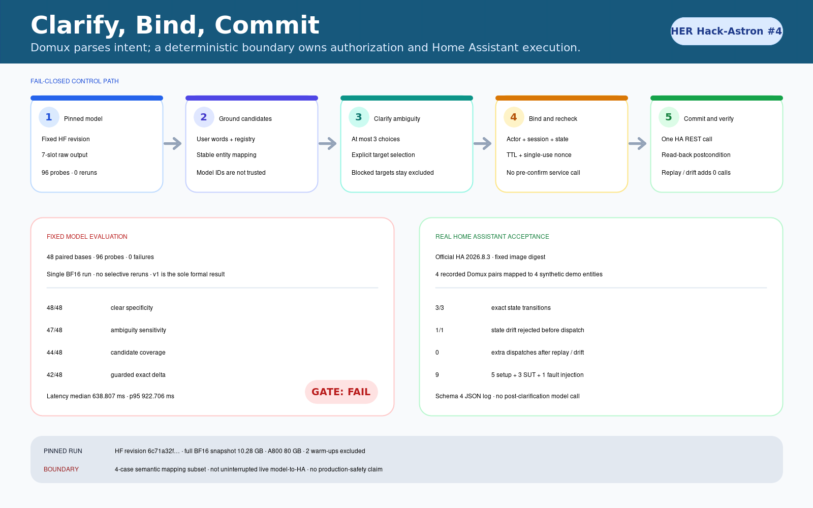

# Clarify, Bind, Commit：有歧义的 Domux 指令先确认，再执行

> 在 48 组清晰／歧义配对指令上，Domux 的 clear specificity 为 48/48，
> ambiguity sensitivity 为 47/48；原始 v1 clarify-and-commit 质量门为
> **FAIL（42/48）**。最终参考实现没有覆盖这个失败结论，而是把 4 条已记录的
> Domux 输出接入真实 Home Assistant：3/3 精确状态变更，1/1 状态漂移在调用前拒绝。



## 真实任务 / Task

“关掉那盏灯”“把卧室空调调到 22 度”可能对应多个同名设备。若集成层默认选择
列表第一项，模型的不确定性会变成真实设备误操作。

本案例实现一条窄而完整的边界：解析 Domux 七槽位输出 → 查找候选 → 有歧义时
展示最多 3 个选项 → 将确认绑定到用户、会话、候选、状态、TTL 和一次性 nonce →
提交前重新校验 → 调用 Home Assistant → 回读并核对精确后置状态。

## Hugging Face 下载证据 / Hugging Face download

- Model: `iFlytekOpenSource/Domux`
- Revision: `6c71a32f4d624cadfd9fce9d10240d8068e53456`
- Full BF16 snapshot: 13 files，`10,279,032,574` bytes
- Snapshot manifest file SHA-256:
  `85ffc0d612758c2dfb1cde6b42623a8f793ad5f4e42e6734694b0c2107389200`
- Canonical 13-file entry digest:
  `5a13462b24fc9b00d132c42718e037bc42fc51a3c6752041998e085579f01416`

为避免继承 shell 中的自定义 HF endpoint：

```bash
env -u HF_ENDPOINT -u HUGGINGFACE_HUB_BASE_URL \
  hf download iFlytekOpenSource/Domux \
  --revision 6c71a32f4d624cadfd9fce9d10240d8068e53456 \
  --local-dir ./domux-6c71a32
```

`run_model.py` 在加载前核验 revision、文件大小、hash 和 Hub 元数据；仓库不包含权重。

## 环境 / Setup

- Python 3.12.12；`transformers.AutoModelForMultimodalLM`
- transformers 5.15.0；torch 2.10.0+cu128；huggingface_hub 1.27.0；
  accelerate 1.13.0
- 单卡 NVIDIA A800-SXM4-80GB；BF16
- greedy；`temperature=0`；`max_new_tokens=128`；seed `20260826`
- 2 条独立 warm-up，不计入开发或评测数据
- 48 base × clear/ambiguous = 96 probes；0 failure；0 selective rerun
- model load 4.564 s；peak allocated 10,244,988,416 bytes
- Home Assistant 官方镜像 `2026.8.3`，固定 digest，loopback 随机端口，
  1.5 CPU / 2 GiB / 512 PIDs / `restart=no`

## 实际过程 / What happened

同一 base 的实际输入和原始输出：

```text
Turn off the Light in the Living Room on the Ground Floor.
turnOff|Light|*|*|*|Living Room|Ground Floor

Turn off the light.
turnOff|Light|*|*|*|*|*
```

另两条代表记录：

```text
Set the hall curtain to 20 percent.
set|Curtain|position|20|Percent|Hall|*

Set the bedroom AC to 22 degrees.
set|AC|temperature|22|Celsius|Bedroom|*
```

全部 96 条输入、raw output、token 数、延迟和 hash 保存在
[`evidence/v1/domux_raw.jsonl`](evidence/v1/domux_raw.jsonl)，没有删样本或选择性重跑。

真实 HA 日志绑定了 4 组固定模型输入／输出、4 条冻结场景和执行时的 policy/runner
hash。精简摘录：

```json
{
  "schema_version": 4,
  "status": "passed",
  "successful_transitions": 3,
  "rejected_before_dispatch": 1,
  "sut_dispatches": 3,
  "service_calls": "5 setup + 3 SUT + 1 fault injection = 9",
  "artifact_sha256": "aa5a70e5d19a0cd90fd673e3f19224231da086dff766ee05aaead8141a6017f0"
}
```

三条成功路径覆盖灯、窗帘位置与空调温度；每条只产生一次 SUT 调用，nonce 重放
新增调用为 0。第四条在 prepare 后通过 HA REST 注入真实状态漂移，提交返回
`state_changed / INVALIDATED`，在 dispatch 前拒绝。

## 结果 / Results

统计单元是 48 个配对 base，不把 96 条 probe 当成独立样本。二元比例使用 Wilson
双侧 95% 区间；预注册比较使用 exact McNemar + Holm 校正；延迟先在 base 内配对，
再汇总 48 个 base。

| 指标 | 结果 | 方法 |
|---|---:|---|
| Clear specificity | 48/48 | fixed v1 paired suite |
| Ambiguity sensitivity / paired discrimination | 47/48 | fixed v1 paired suite |
| Candidate coverage | 44/48 | intended entity in bounded candidates |
| Guarded B2 exact delta | 42/48 | original v1; gate **FAIL** |
| Safe-abstain baseline | 47/48 | dispatch 1/48；wrong target 0/48 |
| Pair latency | median 638.807 ms；p95 922.7055 ms | 48 within-base medians |
| Real HA commits | 3/3 | exact before/after state + postcondition |
| Real HA drift rejection | 1/1 | out-of-band change；0 SUT dispatch |

v1 要求所有 eligible B2 clean/guard trial 通过，因此 42/48 必须写 FAIL。当前顶层
`clarify_commit.py` 是查看失败后的最终参考实现，不用于改写原始 v1 数字。

## 失败语义 / Failure cases

| 场景 | 结果 | 设备调用 |
|---|---|---:|
| malformed `turnOn\|Light` | `ParseError` before prepare | 0 |
| expired confirmation | `expired` | 0 |
| reused nonce | `replayed_nonce` | 0 additional |
| bound state changed | `state_changed / INVALIDATED` | 0 |
| postcondition mismatch | `FAILED_POSTCONDITION`; nonce consumed | 1 already occurred |

最后一项不能假装“未执行”：调用已经发生而状态不可确认时，系统保留失败事实并禁止
相同 nonce 重试。

## 复现 / Reproduction

核心代码测试不需要 GPU 或 Home Assistant：

```bash
cd cases/domux-clarify-commit
python -m unittest discover -s tests -q
```

预期：`Ran 159 tests`，`OK`。

有 Docker 时可重跑真实 HA（仅创建带任务标签的容器/volume，结束时清理）：

```bash
python ha_acceptance.py --output /tmp/domux-ha-acceptance.json
```

完整模型重跑：

```bash
CUDA_VISIBLE_DEVICES=0 python run_model.py \
  --snapshot ./domux-6c71a32 \
  --dataset data/scenarios.jsonl \
  --output /tmp/domux-raw.jsonl \
  --metadata-output /tmp/domux-metadata.json \
  --mode formal --split eval --precision bf16

python evaluate.py \
  --from-frozen-evidence /tmp/domux-raw.jsonl \
  --evidence-metadata /tmp/domux-metadata.json \
  --output-dir /tmp/domux-eval
```

评测质量门不通过时 evaluator 以 exit code 1 结束，同时仍完整写出 report/trials；
这是结果，不是基础设施故障。

## 价值 / Why it mattered

- 模型 raw output 与设备执行分开计数；
- 有歧义先澄清，确认前 0 device call；
- 确认绑定具体状态和一次性 nonce，漂移与重放在执行前失效；
- 调用后回读精确状态，不把 HTTP 200 等同于任务成功；
- 不覆盖失败指标，也不把 4 条 HA 子集包装成生产结论。

## 公开的 Hugging Face Discussion / Published Hugging Face Discussion

- https://huggingface.co/iFlytekOpenSource/Domux/discussions/5

## 安全、隐私与许可 / Safety, privacy, and licensing

- 64 个原创合成 base，只含 Light、Curtain、AC；排除门锁、燃气、报警、摄像头、
  医疗设备和真实硬件。
- 无 token、cookie、私有 endpoint、个人缓存路径、真实家庭或业务数据。
- 合成数据/data card 以 CC BY 4.0 提供；案例代码沿用仓库 Apache-2.0；模型、
  Gemma、Home Assistant 与 runtime 仍按各自上游许可。
- 没有模型权重；只提交脚本、输入、原始文本输出、元数据和已脱敏日志。

## 踩坑记录 / Notes and gotchas

1. 96 probes 只有 48 个独立 base，不能扩大统计分母。
2. setup、fault injection 和 SUT dispatch 必须分账。
3. HTTP 200 后仍要回读并核对目标状态。
4. HA 测试使用 4 个语义映射实体，不是完整场景 inventory。
5. 澄清答案来自冻结的合成 scenario gold，确认后没有再次调用模型；因此这不是
   不间断 live model-to-HA，也不认证 production safety。
6. `preview.png` 是结果信息图；真实运行证据是 raw JSONL 和 HA JSON 日志。
