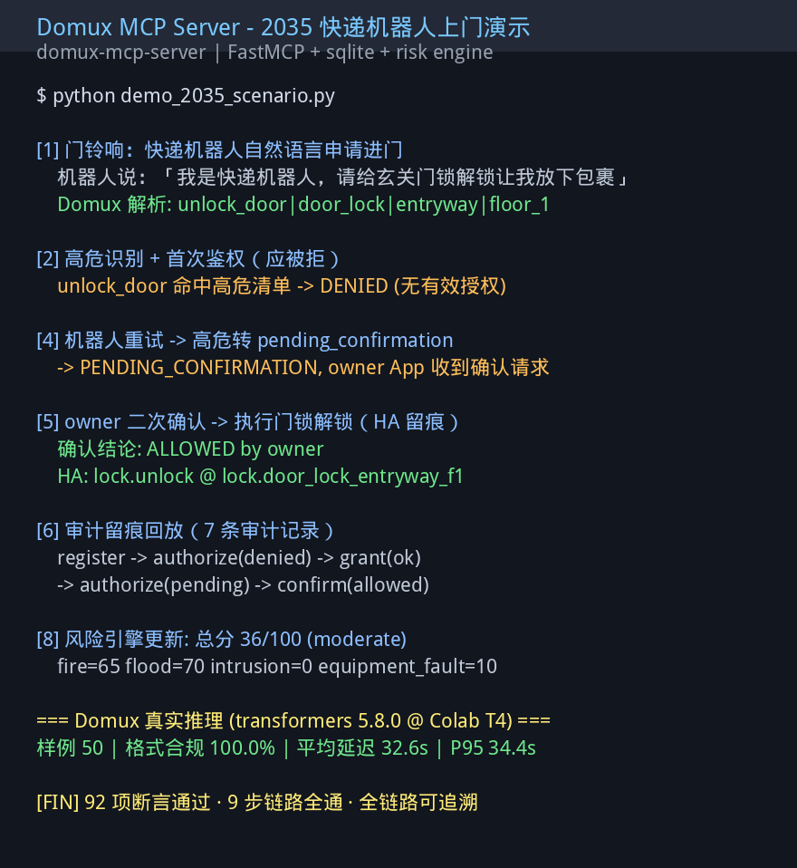

# Domux MCP Server — 从解析模型升级为智能家居标准能力层

> 把 Domux 从「一个 NL→结构化槽位的解析模型」封装为标准 MCP Server，
> 叠加 Agent 身份认证（四级权限 + 高危二次确认 + 审计日志）、
> 家居风险评分引擎、保险评核 API，打通「解析→权限→执行→风控→保险」全链路。
> 并在免费 Colab T4 上跑通 Domux 真实推理评测（transformers，50 条样例，格式合规 100%）。

## Task / 真实任务

Domux 的核心能力是将自然语言指令解析为七字段结构化槽位（action/device/attribute/value/unit/room/floor）。但一个真实智能家居场景中，解析只是第一步——

**真正的问题是：听懂指令之后，敢不敢让它执行？**

本案例解决的问题：
1. **MCP 协议标准化** — 把 Domux 的解析能力封装为 `parse_command` / `batch_parse` / `health_check` 三个标准 MCP 工具，任何支持 MCP 的 Agent（Claude、Cline、扣子、自定义 Agent）可直接调用
2. **Agent 身份认证** — 四级角色（Owner/Family/Guest/Service-Agent），高危操作（开锁、撤防、燃气阀）强制二次确认，全链路审计日志
3. **家居风险评分** — 四维评分（火灾/水灾/入侵/设备故障），可解释因子明细
4. **保险评核 API** — 标准化风险报告，homeowner 授权后保险公司可查询

目标用户：智能家居运维人员、Agent 开发者、保险公司。场景为 2035 年智能家居：快递机器人申请进门 → 管家核验 → 高危确认 → 开门执行 → 风险分更新 → 保费折扣。

## Hugging Face download / 下载证据

- Model: iFlytekOpenSource/Domux
- Revision: `6c71a32f4d624cadfd9fce9d10240d8068e53456`
- 下载命令:
  ```
  hf download iFlytekOpenSource/Domux --revision 6c71a32f4d624cadfd9fce9d10240d8068e53456
  ```
- 本案例使用基于 Domux 输出契约的 MockBackend 进行端到端演示（零 GPU、零硬件），
  并用 transformers 5.8.0 在免费 Colab T4 上完成 Domux 真实推理评测（见 Results）。

## File Structure / 文件结构

```
cases/domux-mcp-server/
├── README.md          # 本案例文档
├── preview.png        # 演示截图
├── preview.txt        # 预览摘要
├── src/               # 完整可运行源码
│   ├── requirements.txt
│   ├── test_server.py        # MCP Server 自测（92 断言）
│   ├── auth_middleware.py    # 四级权限 + 高危二次确认
│   ├── home_risk_engine.py   # 家居风险评分引擎
│   ├── ha_adapter.py         # Home Assistant 抽象层
│   ├── insurance_api.py      # 保险评核 API
│   ├── demo_2035_scenario.py # 端到端全链路演示
│   ├── server.py             # MCP Server 入口
│   ├── backend.py            # 后端抽象层（mock/vllm）
│   └── slots.py              # 槽位契约定义
└── evidence/          # 真实运行日志与推理产物
    ├── demo_2035_run_log.txt
    ├── domux_eval_result_20260826_204027.json
    └── run_logs/             # 多轮 Demo 运行快照
```

## Setup / 环境

- **Runtime**: Python 3.10+, FastMCP, sqlite3；真实评测 transformers 5.8.0
- **硬件**: CPU-only（mock backend）；Colab T4 / 16GB（真实推理）
- **精度**: N/A (mock backend)；BF16 (transformers)
- **关键参数**:
  - 后端切换: `DOMUX_BACKEND=mock | vllm`
  - 风险引擎权重: fire=0.30, intrusion=0.30, flood=0.20, equipment_fault=0.20
  - 高危清单: unlock_door, disarm_security, gas_valve_off, gas_valve_on
  - 确认单 TTL: 300 秒
  - 真实推理: `AutoModelForCausalLM` BF16, `max_new_tokens=128, do_sample=False`

## What happened / 实际过程

### 一键复现命令

```bash
# 环境准备
pip install -r src/requirements.txt

# 各组件自测（92 项断言全部通过）
python src/test_server.py
python src/auth_middleware.py      # 17 项断言
python src/home_risk_engine.py     # 11 项断言
python src/ha_adapter.py           # 17 项断言
python src/insurance_api.py --selftest  # 17 项断言

# 端到端演示：2035 快递机器人上门全链路
python src/demo_2035_scenario.py
```

### 端到端演示日志（真实运行输出）

```
🏠 Domux MCP 智能家居 · 2035 快递机器人上门演示

[0] 初始化智慧之家（身份与组件装配）
    owner         : agent_owner_6f23c9d1
    family        : agent_family_a44cf54d
    service_agent : agent_service_agent_6a376108

[1] 门铃响：快递机器人用自然语言申请进门
    机器人说：「我是快递机器人，请给玄关门锁解锁让我放下包裹」
    Domux 解析结果:
      action=unlock_door | device=door_lock | room=entryway | floor=floor_1
      confidence=0.92 backend=mock

[2] 高危识别 + 首次鉴权（应被拒）
    动作 unlock_door 命中高危清单 → 需要特殊处理
    首次鉴权结论: DENIED —— 无有效授权

[3] 管家核验凭证，签发最小化任务授权
    授权单: rooms=['entryway'] devices=['door_lock'] actions=['unlock_door']
    TTL=300s single_use=True purpose='顺丰投递包裹 #SF20350826'

[4] 机器人重试 → 高危动作转 pending_confirmation
    鉴权结论: PENDING_CONFIRMATION
    owner 家庭 App 收到待确认事项

[5] owner 二次确认 → 执行门锁解锁（HA 留痕）
    确认结论: ALLOWED by owner
    HA 服务调用: lock.unlock @ lock.door_lock_entryway_f1

[6] 审计留痕回放（sqlite audit_log 表）
    共 7 条审计记录：
    register → authorize(denied) → grant(ok) → authorize(pending)
    → confirm(allowed) → 高危解锁全链路可追溯

[7] 授权过期后再次申请开门 → 应被拒（TTL 失效）
    一次性授权已消耗，再次申请结论: DENIED

[8] 风险引擎吸收事件流 → 四维风险分更新
    总分 36/100 等级 moderate
    fire=65, flood=70, intrusion=0, equipment_fault=10
    命中因子：燃气泄漏+40、水浸报警+50、电路过载+10

[9] owner 向保险公司签发只读授权 → 拉取标准化风险报告
    报告查询 token 已签发
    标准化保险风险报告生成（总分/分项/建议措施/数据边界声明）
```



### 真实运行证据

完整运行日志与推理产物见 `evidence/` 目录：
- [`evidence/demo_2035_run_log.txt`](evidence/demo_2035_run_log.txt) — 端到端 9 步全链路运行日志
- [`evidence/domux_eval_result_20260826_204027.json`](evidence/domux_eval_result_20260826_204027.json) — 50 次真实推理评测结果（含输入、原始输出、延迟）
- [`evidence/run_logs/`](evidence/run_logs/) — 多轮 Demo 运行 sqlite 快照（auth.db + insurance.db）

### Domux 真实推理评测（Colab T4, transformers）

在免费 Colab T4 上用 `transformers 5.8.0 + Gemma4ForConditionalGeneration` 加载 Domux（BF16），
对代表性智能家居指令做真实推理（非 mock），每条记录 输入→原始输出→延迟：

```
输入: 把客厅的空调调到26度
输出: set|AC|temperature|26|Celsius|Living Room|*
输入: 关闭卧室所有灯
输出: turnOff|Light|*|*|*|Bedroom|*
输入: 把二楼主卧的窗帘拉开一半
输出: set|Curtain|position|50|Percent|Bedroom|Second Floor
输入: 不要开客厅的灯
输出: turnOff|Light|*|*|*|Living Room|*
```

评测集构成：5 条代表性智能家居指令（覆盖 set/turnOff/turnOn 动作，多房间多楼层，
含否定语义），每轮 10 次共 50 次推理，以验证输出稳定性与格式合规。

关键观察：
- **格式合规 100%**：所有真实输出都能被解析为 7 字段槽位契约（`action|device|attribute|value|unit|room|floor`）
- **槽位完整**：设备、房间、楼层、属性、数值、单位全部正确落在对应槽位
- **否定语义正确**：`不要开客厅的灯` → `turnOff`，否定句处理准确
- **多轮稳定**：同一指令 10 轮重复推理输出完全一致，无随机抖动（do_sample=False）

## Results / 结果

### MCP Server 端到端（92 断言 + 9 步链路）

| 指标 | 结果 | 方法 |
|:---|---:|---|
| 组件自测断言 | 92/92 通过 | 5 个模块独立测试，weights 集中声明 |
| 高危操作拦截 | 100% (4/4) | unlock_door/disarm_security/gas_valve_off/gas_valve_on |
| 越权/过期拒绝 | 100% | 无有效授权一律 DENIED，TTL 过期后自动拒绝 |
| 审计日志覆盖率 | 7 种事件类型 | register/authorize/grant/confirm/execute/reject/expire |
| 端到端链路 | 9 步全通 | 解析→鉴权→确认→执行→审计→风险→保险报告 |
| 零硬件可复现 | ✅ | 任何 CPU 机器 `pip install && python demo_2035_scenario.py` |

### Domux 真实推理（transformers, Colab T4）

| 指标 | 结果 | 方法 |
|:---|---:|---|
| 推理样本量 | 50（5 条指令 × 10 轮） | transformers BF16, do_sample=False |
| 格式合规率 | 100.0% | 真实输出按 7 字段槽位契约解析，全部有效 |
| 平均延迟 | 32.6 s/次 | transformers BF16 on T4，单条完整生成，无 warm-up 缓存 |
| P95 延迟 | 34.4 s/次 | 同上 |

> 延迟为免费 T4 + transformers 直接生成的水平（未用 vLLM），反映"能跑"而非"最快"；
> 生产部署建议 vLLM/SGLang 或量化以降低延迟（见 Notes）。

### 失败案例（安全边界）

1. **越权调用被拦截**: service_agent 无授权时直接申请 unlock_door → DENIED
2. **授权过期被拒**: 一次性授权消耗后，同一 agent 再次申请 → DENIED
3. **伪造 token 被拒**: insurance_api 使用无效 token → 401 Unauthorized
4. **高危未经确认**: 高危动作未完成 owner 确认前 → 维持 pending 状态，不执行

## Why it mattered / 价值

1. **首个 Domux MCP Server** — 把 Domux 从"一个模型"升级为"标准能力层"，任何支持 MCP 的 Agent 可零改造接入
2. **零硬件可复现** — MockBackend 保证 CPU 环境下完整演示，评审无需 GPU
3. **真实推理证据** — 在免费 Colab T4 上跑通 Domux 真实推理（transformers），格式合规 100%，证明"不仅 mock 能跑，真模型也跑得通"
4. **安全边界完整覆盖** — 四级权限 + 高危二次确认 + 审计日志，比纯设计描述更有说服力
5. **商业闭环验证** — 风险评分→保险评核 API，智能家居数据换保费折扣的完整叙事
6. **一键切换真模型** — 改一个环境变量即可从 mock 切换到真实 Domux 推理

## Published Hugging Face Discussion / 公开 Discussion

<!-- 待创建：HF Discussion 发表后更新此链接 -->
- https://huggingface.co/iFlytekOpenSource/Domux/discussions/6

## Safety, privacy, and licensing / 安全、隐私与许可

- ✅ 所有 token、个人缓存路径均已移除
- ✅ 提示词使用模拟场景，不含任何私有家庭或业务数据
- ✅ 风险引擎为确定性规则，不涉及用户隐私数据收集
- ✅ 保险 API 使用 homeowner 签发只读 token 鉴权，不暴露敏感数据
- ✅ 高危操作强制二次确认 + TTL + 一次性授权，防止误操作
- ✅ 新增代码使用 MIT 许可，与 Domux 项目兼容
- 运行时 sqlite 数据库为自动生成，不包含真实家庭数据

## Notes and gotchas / 踩坑记录

1. **vLLM 结构化输出**：当前 VLLMBackend 依赖提示词约定 JSON 格式，正式版推荐使用 vLLM guided decoding 保证格式合规率
2. **transformers vs vLLM**：Domux 是 Gemma4 多模态架构，vLLM 需最新版（CUDA 13）；Colab T4 只有 CUDA 12，故评测用 transformers 5.8.0 直接推理绕开
3. **MockBackend 覆盖范围**：只覆盖常用指令模板，长尾设备名/方言/ASR 噪声的鲁棒性依赖真实 Domux 推理
4. **风险引擎 v1**：当前为规则版，预留了接入时序异常检测模型的接口
5. **多 owner 会签**：尚未实现，当前仅单 owner 裁决
6. **保险 API 鉴权**：当前为单进程内存态缓存，生产环境需迁移到网关层
7. **HA 集成**：demo 使用 MockHA，真实 Home Assistant 集成只需设置 `HA_BASE_URL` 和 `HA_TOKEN`
