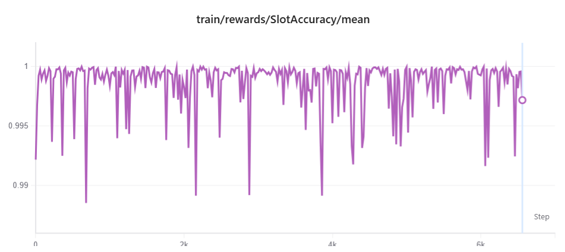
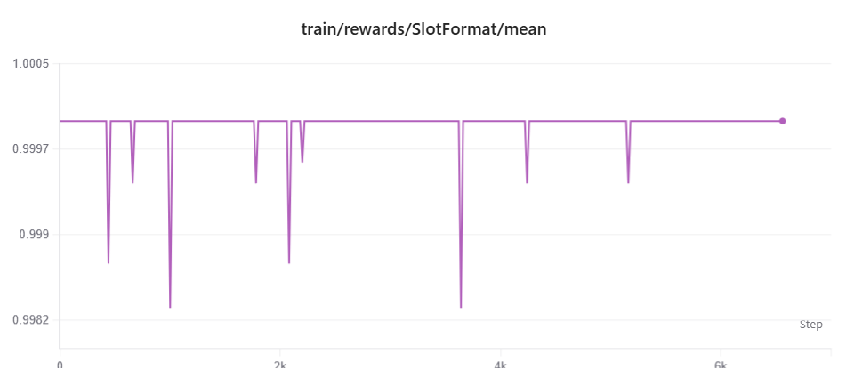

<div align="center">
  <b>English</b> | <a href="interpretability-report.zh.md">简体中文</a>
</div>

---

<div align="center">
  <h1>SFT + GRPO Interpretability Report</h1>
  <p><b>Why Domux's two-stage training works, and what GRPO actually changes</b></p>
</div>

---

## 📋 Table of Contents

- [📌 TL;DR](#-tldr)
- [🎯 1. Introduction: Reasoning Backward from the Result](#-1-introduction-reasoning-backward-from-the-result)
- [🧱 2. The Two-Stage Paradigm: SFT Does the Heavy Lifting, GRPO Refines](#-2-the-two-stage-paradigm-sft-does-the-heavy-lifting-grpo-refines)
- [🔬 3. Core Evidence: What GRPO Fixed and What It Broke](#-3-core-evidence-what-grpo-fixed-and-what-it-broke)
- [📊 4. Field-Level Evidence and How It Echoes the Reward Design](#-4-field-level-evidence-and-how-it-echoes-the-reward-design)
- [🧭 5. Mechanism, Limitations, and Future Work](#-5-mechanism-limitations-and-future-work)
- [🔁 Reproducibility](#-reproducibility)

---

## 📌 TL;DR

This report answers one question: **why does training Domux with SFT + GRPO work?** The conclusions rest on training logs (SwanLab) and a sample-by-sample comparison on the test set — not on a post-hoc narrative.

In one sentence:

> **SFT already does almost all of the capability acquisition, pushing the model close to the ceiling. GRPO is not "learning something new" — it performs targeted refinement on the long tail SFT leaves behind: collapsing surface variants onto a single canonical form and suppressing hallucinated slots. The gain is small but directional, and its cost is diagnosable.**

Key facts at a glance (from a paired analysis of 6,733 test samples, reproducible via [Reproducibility](#-reproducibility)):

| Metric | SFT | SFT+GRPO | Change |
| --- | --- | --- | --- |
| Exact-match rate (EM) | 86.54% | 87.20% | **+0.65 pp** |
| Avg. field accuracy | 97.23% | 97.67% | **+0.44 pp** |
| Samples GRPO fixed | — | — | **53** |
| Samples GRPO broke | — | — | **9** |
| Fix : break ratio | — | — | **≈ 5.9 : 1** |
| Training reward (reached by end of SFT) | ~0.999 | — | near-saturated |

Three findings worth remembering:

1. **Training reward is saturated at ~0.999 from GRPO's very first step** — capability comes mainly from SFT; GRPO's working room is in the tail.
2. **GRPO's fixes concentrate on canonicalization**: device names (29), rooms (22), actions (10) — e.g. `Sleep Mode → Sleeping Mode`, `Light → Shower Light`, `turnOn|Relax → activate|Relax Mode`.
3. **All 9 of GRPO's regressions are the same over-generalization**: it "normalizes" the rare compact name `LightA` into `Light A` — the way it fails is itself proof of what it learned.

---

## 🎯 1. Introduction: Reasoning Backward from the Result

Domux is trained in two stages: LoRA supervised fine-tuning (SFT) on labeled data, then GRPO reinforcement learning with custom reward functions (see [`training/README.md`](../training/README.md)). The combination works in practice and the metrics are good, but "why it works" has so far lived at the level of intuition.

The goal here is to complete the causal chain "design choice → training dynamics → observable result," **trusting only the parts that logs or test data can confirm**. Where the data does not support an inference, it is explicitly flagged as speculation or future work, not dressed up as a conclusion.

One caveat worth stating up front: one of our early hypotheses — that the dual reward would form an easy-to-hard *implicit curriculum* — was **falsified** once we looked at the training curves. The curves show both rewards saturated from the start; there is no "learn format first, then semantics" phase. We keep this correction in the report because it is itself an example of letting evidence constrain the explanation.

> ⚠️ **Data-source disclaimer**: The test data in this report comes from an **internal family eval set** (6,733 samples, grouped by layout fy001–fy006), which is a **different dataset** from the **official test set** shipped with this repository under [`eval/`](../eval/) (`smart_home_control_test_set.jsonl`, grouped by category) — the two share almost no queries (only 36 in common). Their scoring conventions also differ: the official script [`eval/run_eval.py`](../eval/run_eval.py) reports Result accuracy (order-independent set match) and Slot F1, while this report uses exact-match (EM) and per-field-position average accuracy. **The numbers here are therefore not directly comparable to the official eval metrics.** The value of this report lies in the **per-sample paired difference between SFT and GRPO on the same data**, a comparison unaffected by the convention gap.

---

## 🧱 2. The Two-Stage Paradigm: SFT Does the Heavy Lifting, GRPO Refines

### 2.1 What the Training Curves Say

During GRPO training, the mean curves of the two reward functions (`SlotAccuracy` and `SlotFormat`, defined in [`training/rewards/reward_plugin_slot.py`](../training/rewards/reward_plugin_slot.py)) share a striking feature:

- **`SlotAccuracy/mean`**: sits at **~0.999** from step 0, hugging 1.0 throughout, with only occasional downward spikes (to 0.99–0.992) that snap back quickly.
- **`SlotFormat/mean`**: sits at **~0.9998** from step 0, essentially a flat line, with rare spikes down to 0.998.

> 📈 *Figure 1: Reward curves during GRPO training (SwanLab). Both are already saturated at GRPO's starting point, with only occasional downward spikes that snap back quickly.*

<div align="center">
  
  
</div>

The implication: **before GRPO even begins, the SFT model has already pushed both format compliance and slot accuracy close to the ceiling.** So the GRPO stage contains no "capability from scratch" learning — it faces an already-strong initial policy.

### 2.2 Why This Is Exactly What Proves SFT Is a Precondition for GRPO

GRPO uses no value network (critic); a rollout's advantage is estimated purely from **within-group relative scores**:

```
A_i = (r_i − mean(r_1..r_G)) / std(r_1..r_G)
```

This formula has an easily-overlooked prerequisite: **there must be reward variance within the group**. If the G samples for one prompt all score nearly the same (reward saturated → within-group std → 0), then the advantage A_i ≈ 0 and that group contributes almost nothing to the gradient.

Lining this up with the curves makes it click:

- Near-saturated reward → tiny within-group variance for the vast majority of steps → tiny gradient;
- **The only place an effective gradient arises is at those downward spikes**: sampling occasionally emits a bad rollout, which differs from the other good samples in the group, within-group variance becomes non-zero, and GRPO pushes that bad sample's probability down at that step;
- The spikes snapping back to 1.0 are the visualization of this "suppress bad outputs" process.

Hence the core claim of this section:

> **SFT moves the policy's sampling distribution into the region where the reward function can give a meaningful signal; GRPO refines within that region. Skip SFT and run GRPO on the base model directly, and sampling would almost never hit the legal 7-field format — the whole group scores 0, variance collapses, and GRPO has no gradient from step one. SFT is not an optional warm-up; it is the necessary condition for GRPO's gradient to be non-trivial.**

### 2.3 Why You Cannot Just Run SFT All the Way

If SFT is this strong, why bother with GRPO? Because SFT's objective (behavior cloning, equivalent to minimizing the forward KL) is **mode-covering**: to cover every phrasing seen in the data, it tends to spread probability mass rather than sharpen toward the single correct output for each input.

The consequence: the post-SFT model still **wavers among near-synonymous surface forms** — it knows roughly what to output, but is not decisive where sharpening is required ("`set` or `adjustUp`?", "should the device name be normalized?", "should this be `*`?"). That is exactly where the test-set errors come from, and exactly what GRPO (mode-seeking, sharpening toward the high-reward solution) can fix. The next section confirms this with per-sample data.

---

## 🔬 3. Core Evidence: What GRPO Fixed and What It Broke

We paired the outputs of the SFT and SFT+GRPO models on the same test set (6,733 samples across 6 home layouts, fy001–fy006) **sample by sample**, and tracked changes in exact-match status.

### 3.1 Paired Result: Conservative Edits, Far More Fixes Than Breaks

| Paired state | Count |
| --- | --- |
| Both correct | 5818 |
| Both wrong | 853 |
| **GRPO fixed** (SFT wrong → GRPO right) | **53** |
| **GRPO broke** (SFT right → GRPO wrong) | **9** |
| **Net gain** | **+44 (+0.65 pp), fix : break ≈ 5.9 : 1** |

Two observations:

1. **GRPO's edits are very conservative** — of 6,733 samples it touched only 62 (~0.9%), leaving 96.8% unchanged. This matches the "near-saturated, low-gradient" picture from §2.2: it makes no sweeping changes, only works at the margins.
2. **Fix : break ≈ 6 : 1** — this is precisely the test-set counterpart of the "spikes snapping back" in the training curves: GRPO is suppressing low-frequency bad outputs.

### 3.2 What Kinds of Errors GRPO Fixed

By the SFT error field among the fixed samples (one sample may have multiple wrong fields):

| SFT error field | Times fixed |
| --- | --- |
| device | 29 |
| room | 22 |
| action | 10 |
| floor | 5 |
| attribute | 2 |
| value | 1 |

A few real examples — the theme is highly consistent:

```
"switch the mode to sleeping"
  SFT : activate|Sleep Mode|*|*|*|*|*          ← device name not collapsed to canonical form
  GRPO: activate|Sleeping Mode|*|*|*|*|*        ← fixed

"brighten the shower light on the first floor"
  SFT : adjustUp|Light|brightness|*|*|Shower|First Floor   ← device split wrong + hallucinated room
  GRPO: adjustUp|Shower Light|brightness|*|*|*|First Floor  ← merged device name + dropped spurious room

"set the relax in the master bedroom on the first floor"
  SFT : turnOn|Relax|*|*|*|Master Bedroom|First Floor      ← wrong action + device for a scene mode
  GRPO: activate|Relax Mode|*|*|*|Master Bedroom|First Floor ← fixed

"set the bedside light brightness to 50 percent"
  SFT : set|Bedside Light|brightness|50|Percent|Bedroom|*  ← invented a room out of nowhere
  GRPO: set|Bedside Light|brightness|50|Percent|*|*         ← suppressed the hallucinated slot
```

In summary, GRPO's fixes cluster around **two themes**:

- **Canonicalization**: collapsing surface phrasings onto a single standard form — `Sleep → Sleeping Mode`, `Light → Shower Light`, scene words `turnOn|Relax → activate|Relax Mode`. This is exactly the §2.3 point in action: SFT's mode-covering wavers among near-synonymous forms, and GRPO's mode-seeking sharpens it.
- **Suppressing hallucinated slots**: removing `room` / `floor` values SFT invented (e.g. `set bedside light` wrongly filling `Bedroom`).

---

## 📊 4. Field-Level Evidence and How It Echoes the Reward Design

### 4.1 Field-Level Accuracy

Computing accuracy per field position on the paired data (segment-count-matched subset, n=6,724):

| Field | Reward weight | SFT | GRPO | Δ |
| --- | --- | --- | --- | --- |
| action | 0.25 | 0.9857 | 0.9896 | +0.39 pp |
| device | 0.25 | 0.9346 | 0.9380 | +0.34 pp |
| attribute | 0.20 | 0.9881 | 0.9955 | **+0.74 pp** |
| value | 0.15 | 0.9957 | 0.9975 | +0.18 pp |
| unit | 0.05 | 1.0000 | 1.0000 | 0.00 pp |
| room | 0.08 | 0.9114 | 0.9207 | **+0.94 pp** |
| floor | 0.02 | 0.9970 | 0.9993 | +0.22 pp |

> Field weights are in [`reward_plugin_slot.py`](../training/rewards/reward_plugin_slot.py) (`FIELD_WEIGHTS`).

### 4.2 A Detail That Must Be Handled Honestly

Intuitively one expects "higher-weight fields improve more." The data **partly supports and partly contradicts** this, and that must be stated plainly:

- **device is the lowest-accuracy field overall (0.93–0.94)** and also the one GRPO fixed most often (29 times). High weight (0.25) plus large room for error makes it the main focus — this matches intuition.
- **But room has the largest field-accuracy gain (+0.94 pp), while room's weight is only 0.08.** So room's improvement is not driven directly by its reward weight; it more likely **rides along with device fixes**: in the `Light + Shower → Shower Light` example, merging the device name correctly also makes the `Shower` that was wrongly placed in room disappear — device and room flip correct together.

In other words, **field-level gains cannot be explained linearly by weight magnitude**; canonicalization happens at the granularity of a whole command, and a single fix often corrects multiple fields at once. This is an observed phenomenon, not something anticipated at design time, and is recorded as such.

---

## 🧭 5. Mechanism, Limitations, and Future Work

### 5.1 GRPO's 9 Regressions Reveal Its Mechanism

The most interpretively valuable part is precisely the 9 samples GRPO broke. They are **all concentrated in fy006** (also the only layout where GRPO lowered EM: 0.6135 → 0.6074), and are almost the same error:

```
"turn off the lighta..."   expected: turnOff|LightA|...
  SFT : turnOff|LightA|...   ← right
  GRPO: turnOff|Light A|...  ← split the compact device name apart
```

The mechanism is clear:

> GRPO learned a strong prior from the training data — **multi-word device names take a space** (`Strip Light`, `Shower Light`, `Spot Light`…, which is also the [`output-spec`](output-spec.md) convention). This prior is correct in the vast majority of cases and is the source of the many fixes in §3.2. But it **over-generalized**, "normalizing" the rare compact names `LightA / LightC` in fy006 into `Light A / Light`.

This is a **known cost** of mode-seeking (reverse-KL) policy improvement: converging on the dominant mode sacrifices rare exception modes. Worth emphasizing — **the way GRPO breaks things is itself proof of what it learned right**: its regressions are not random noise but "applying the canonicalization rule too far," the very same mechanism that produces its gains.

### 5.2 A Boundary That Must Be Made Clear: The Gain Is in Generalization, Not Training Reward

To be honest: training reward saturated at ~0.999 long ago (§2), which both shows SFT is already strong and means **the reward function has nearly lost discriminative power at this level** — it can barely tell "good" from "better." So GRPO's room to extract value on the training distribution is inherently limited; its value shows up in **long-tail fixes on the test set (generalization)**, not in further lifting training metrics. This also explains why the overall gain looks modest (EM +0.65 pp): under the ceiling effect, only that tail was ever movable.

For a **command-parsing** task, this tail matters more than it appears: one wrong command = one wrong physical action. The reliability benefit of pushing down worst-case errors (fix : break ≈ 6 : 1) deserves more attention than a decimal point on the mean metric.

### 5.3 A Convention Tension Worth Noting: Training Cares About Order, Evaluation Does Not

One design detail is worth recording: **the reward function [`reward_plugin_slot.py`](../training/rewards/reward_plugin_slot.py) is order-sensitive** — it uses LCS alignment to preserve the order of command segments (the comments explicitly note that `turnOff→turnOn` differs from `turnOn→turnOff`), whereas the Result accuracy in the official eval script [`eval/run_eval.py`](../eval/run_eval.py) is an **order-independent set match**. In other words, the model is penalized at training time for getting segment order wrong, yet the same ordering error may be scored as correct at eval time.

The impact on the current task is limited (most instructions have no mandatory ordering among their segments), but it is a genuine reward–eval mismatch. If order-sensitive instructions are introduced in the future (e.g. "turn off, then on"), the eval convention should be aligned with the reward convention. We record this point without claiming it as an observed problem.

### 5.4 Limitations and Future Work

The conclusions are bounded by the available data. The following are not yet verified and are left as future work — **not presented as established conclusions**:

- **No ablation study**: the effect of "removing `SlotFormat`, keeping only `SlotAccuracy`" on convergence was not isolated. Claims about each reward's individual contribution therefore remain at the level of mechanistic inference.
- **Field-level accuracy is a post-hoc parse, different from the official Slot F1**: the field-level accuracy here is **parsed post-hoc** from paired outputs (segment-count-matched subset, average accuracy per field position). It differs in both algorithm and convention from the **Slot F1** (greedy alignment + 2PR/(P+R)) in the official script [`eval/run_eval.py`](../eval/run_eval.py); the two numbers are not directly comparable.
- **fy006's over-generalization is targetable**: e.g. add compact-naming samples to the SFT/GRPO data, or penalize "rewriting a device name without grounding" in the reward. This is a concrete improvement direction driven by this report's finding.
- **Single run, no seed repeats**: a ±0.65 pp gain has not undergone significance testing across multiple reruns.

---

## 🔁 Reproducibility

Every number in this report can be regenerated by the paired-analysis script. It takes the SFT and GRPO eval result JSONs as input and outputs overall metrics, paired transitions (fixes/breaks), per-family and per-field breakdowns, and all regression samples:

```bash
python analyze_eval.py <SFT_eval.json> <GRPO_eval.json>
```

> ℹ️ The test data and analysis script live in an internal environment and are not distributed with this repository; this report cites only aggregated statistics. Training curves are in the SwanLab experiment log.

---

<div align="center">

**Related**: [Training Guide](../training/README.md) · [Output Spec](output-spec.md) · [Main README](../README.md)

</div>
